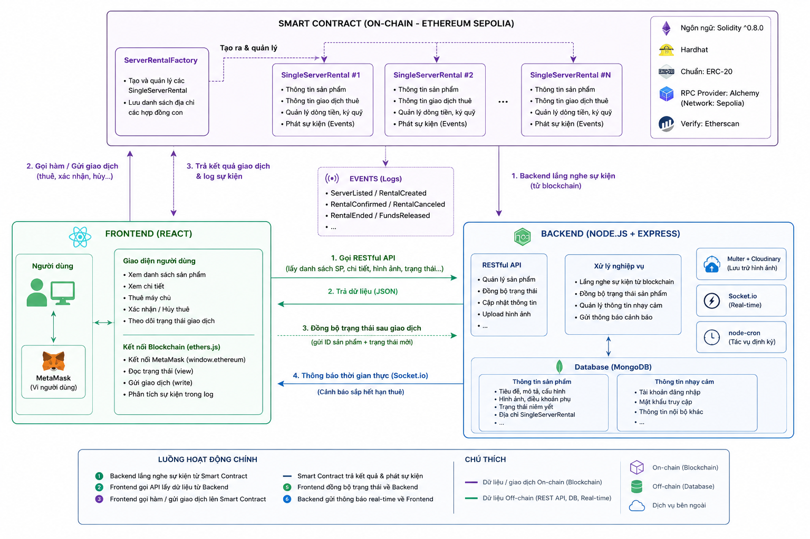
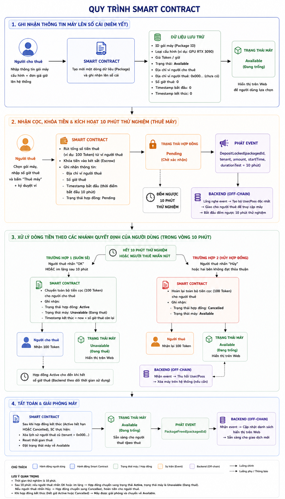

# 🖥️ TrustRent - Nền Tảng Cho Thuê Máy Chủ Phi Tập Trung


---

## 📌 Tổng Quan Hệ Thống

**TrustRent** là một ứng dụng phi tập trung (DApp) vận hành theo mô hình kinh tế chia sẻ ngang hàng (Peer-to-Peer), đóng vai trò giao thức trung gian kết nối thị trường tài nguyên tính toán: người sở hữu hạ tầng máy chủ nhàn rỗi (VPS, GPU) với người cần thuê ngắn hạn theo giờ.

Đặc trưng cốt lõi của hệ thống nằm ở việc **không có bất kỳ tổ chức trung gian nào nắm quyền kiểm soát dòng tiền của người dùng**. Toàn bộ điều khoản thuê — từ đơn giá, thời lượng, đến cơ chế ký quỹ và hoàn tiền — được mã hóa cứng thành các quy tắc thực thi tự động trên Smart Contract, vận hành theo cơ chế **luồng kép (Dual-stream)**: dòng tiền xử lý hoàn toàn on-chain để đảm bảo tính minh bạch tuyệt đối, trong khi dữ liệu nghiệp vụ nhạy cảm (thông tin truy cập máy chủ) được điều phối off-chain để đảm bảo quyền riêng tư.

---

## 👥 Danh Sách Thành Viên Nhóm

| Họ và Tên | MSSV |
|---|---|
| Nguyễn Anh Duy | K244141603 |
| Trần Hoàng Bảo Ân | K244141598 |
| Trần Hoàng Hương Giang | K244141604 |
| Trần Thị Bảo Hà | K244141606 |
| Huỳnh Thị Minh Hạnh | K244141607 |
| Nguyễn Minh Hằng | K244141608 |
| Nguyễn Minh Hiếu | K244141611 |
| Huỳnh Thị Thúy Kiều | K244141624 |

**GVHD:** ThS. Ngô Phú Thanh — Khoa Tài Chính – Ngân Hàng

---

## 📉 Thực Trạng & Lý Do Chọn Đề Tài

Nhu cầu tính toán hiệu năng cao phục vụ AI và chuyển đổi số đang tăng trưởng mạnh, kéo theo nhu cầu thuê hạ tầng máy chủ (VPS, GPU) theo giờ ngày càng phổ biến, do chi phí sở hữu phần cứng vẫn là rào cản lớn với cá nhân nghiên cứu và doanh nghiệp khởi nghiệp.

Tuy nhiên, thị trường cho thuê máy chủ hiện tại tồn tại một nghịch lý niềm tin: người có máy nhàn rỗi và người cần thuê đều e ngại giao dịch trực tiếp với người lạ — người thuê sợ mất tiền mà không nhận đúng cấu hình, chủ máy sợ giao quyền truy cập rồi không được thanh toán. Các nền tảng trung gian Web2 giải quyết được vấn đề này nhưng đánh đổi bằng chi phí cao, kiểm soát dữ liệu độc quyền và thiếu cơ chế xử lý tranh chấp minh bạch.

Nhóm chọn đề tài này vì đây là hướng nghiên cứu còn mới tại Việt Nam, có tính ứng dụng thực tiễn cao, đồng thời là cơ hội để đào sâu kiến trúc Smart Contract và phát triển ứng dụng phi tập trung hoàn chỉnh.

---

## 🎯 Mục Tiêu Dự Án

Mục tiêu tổng thể là loại bỏ hoàn toàn vai trò trọng tài của bên trung gian tập trung, thay thế bằng một bộ quy tắc toán học không thể thiên vị, cụ thể qua ba mục tiêu sau:

- **Ký quỹ tự động (Escrow):** Tiền thuê bị giữ trong quỹ trung gian phi tập trung ngay khi khách đặt thuê, chỉ giải ngân khi điều kiện xác nhận được thỏa mãn — loại bỏ rủi ro chiếm dụng vốn từ cả hai phía.
- **Giai đoạn kiểm tra thực tế 10 phút:** Trước khi tiền chính thức về tay chủ máy, người thuê có quyền đăng nhập kiểm tra cấu hình thật, tự quyết định xác nhận hoặc hủy lấy lại tiền ngay lập tức.
- **Minh bạch hóa toàn bộ lịch sử giao dịch:** Mọi sự kiện quan trọng (niêm yết, ký quỹ, xác nhận, hủy) được ghi vĩnh viễn lên sổ cái Blockchain, kiểm chứng được độc lập bởi bất kỳ ai mà không cần tin vào uy tín của nền tảng.

---

## 🛠️ Chi Tiết Các Công Nghệ Sử Dụng

<p align="center">
  
</p>

### ⛓️ Smart Contract
Viết bằng **Solidity (^0.8.0)**, biên dịch và triển khai qua **Hardhat**, chạy trên mạng thử nghiệm **Ethereum Sepolia** thông qua **Alchemy RPC**, mã nguồn được verify công khai trên Etherscan. Tuân thủ chuẩn **ERC-20** cho token thanh toán. Kiến trúc áp dụng **Factory Pattern**: hợp đồng `ServerRentalFactory` đóng vai trò sinh ra các hợp đồng con `SingleServerRental` độc lập cho từng máy chủ, đảm bảo dòng tiền và trạng thái tách biệt hoàn toàn giữa các giao dịch diễn ra song song.

### 🎨 Frontend
Xây dựng trên **React + Vite**, giao diện dùng **Tailwind CSS**, điều hướng qua **React Router DOM**. Kết nối Web3 thông qua thư viện **ethers.js**, giao tiếp trực tiếp với ví **MetaMask** qua `window.ethereum` để người dùng tự ký duyệt mọi giao dịch. Dữ liệu off-chain gọi qua **Axios** tới RESTful API của Backend; dữ liệu on-chain gọi trực tiếp vào Smart Contract.

### ⚙️ Backend
Sử dụng **Node.js + Express.js** xây dựng REST API bất đồng bộ, lưu trữ dữ liệu tại **MongoDB Atlas** qua **Mongoose**. Hình ảnh sản phẩm xử lý qua **Multer + Cloudinary**. Tích hợp **Socket.io** cho thông báo thời gian thực và **Node-cron** cho tác vụ giám sát định kỳ thời gian thuê còn lại.

---

## 🔄 Quy Trình, Luồng Vận Hành Của Hệ Thống

<p align="center">
  
</p>

Quy trình vận hành xuyên suốt từ lúc đăng máy đến khi đóng hợp đồng gồm 6 giai đoạn nối tiếp:

```
① Niêm yết gói máy
        ↓
② Khách thuê & khóa tiền (Smart Contract giam tiền ký quỹ)
        ↓
③ Bàn giao quyền truy cập (Backend trả Username/Password)
        ↓
④ Giai đoạn 10 phút kiểm tra
   ├── Xác nhận OK → tiền chuyển cho chủ máy, hợp đồng kích hoạt
   └── Hủy → hoàn 100% tiền ngay, không cần ai phê duyệt
        ↓
⑤ Cảnh báo còn 15 phút (Socket.io đẩy thông báo real-time)
        ↓
⑥ Tất toán → thu hồi quyền truy cập, máy trở lại trạng thái trống
```

Phía Smart Contract, mỗi giao dịch là một máy trạng thái độc lập (`Pending → Active/Cancelled → Completed`), nơi quyền hủy và nhận hoàn tiền của người thuê chỉ tồn tại trong đúng khung 10 phút đầu, sau đó tự động bị vô hiệu hóa để bảo vệ quyền lợi của chủ máy.

---

## 💡 Phân Tích Kết Quả Và Hạn Chế

### ✅ Kết quả đạt được
Nhóm đã hoàn thiện một mô hình cho thuê máy chủ ảo mô phỏng đầy đủ vòng đời giao dịch — từ niêm yết, ký quỹ, xác nhận, đến thu hồi tài nguyên — với cơ chế escrow tự động đảm bảo không bên nào có thể đơn phương chiếm dụng vốn của bên kia. Việc tách trách nhiệm rõ ràng giữa Smart Contract (tài chính, bất biến) và Backend (vận hành, linh hoạt) tận dụng đúng ưu điểm riêng của từng nền tảng.

### ⚠️ Hạn chế hiện tại
Thông tin đăng nhập máy chủ (username/password) vẫn cần lưu trữ tại Backend do giới hạn bảo mật của blockchain công khai, khiến hệ thống chưa thể phi tập trung hóa hoàn toàn. Quá trình cấp phát máy chủ cũng chưa tự động hóa ở tầng hạ tầng vật lý — chủ máy vẫn phải tự cung cấp tài khoản tĩnh thay vì hệ thống tự sinh máy ảo. Ngoài ra, các cơ chế nâng cao như đánh giá uy tín, xử lý tranh chấp phức tạp hay gia hạn hợp đồng chưa được tích hợp.

---

## 🚀 Định Hướng Phát Triển

- **Gia hạn hợp đồng (Renew):** cho phép tiếp tục thuê mà không cần tạo giao dịch mới.
- **Hệ thống đánh giá uy tín (Reputation):** tăng độ tin cậy cho cả hai phía giao dịch.
- **Cơ chế thưởng (Reward Token):** khuyến khích người dùng duy trì tỷ lệ hoàn thành giao dịch cao.
- **Đa nhà cung cấp hạ tầng:** mở rộng tích hợp Google Cloud, AWS, Azure để tự động hóa cấp phát máy ảo thật.
- **Bảo mật nâng cao:** mã hóa và quản lý khóa an toàn hơn cho thông tin truy cập máy chủ.

---

## 🔍 Minh Bạch Smart Contract

Toàn bộ hợp đồng được triển khai và xác minh công khai trên **Ethereum Sepolia Testnet**:

| Smart Contract | Địa chỉ | Trách nhiệm |
|---|---|---|
| `ServerRentalFactory.sol` | [`0xB7BA323CF8634ED2a51bD6f96034E7e53D728A3a`](https://sepolia.etherscan.io/address/0xB7BA323CF8634ED2a51bD6f96034E7e53D728A3a) | Hợp đồng mẹ, sinh và quản lý danh sách hợp đồng con |
| `SingleServerRental.sol` | *(địa chỉ động, sinh tự động cho mỗi máy chủ đăng bán)* | Quản lý ký quỹ, trạng thái và vòng đời thuê độc lập |

---

<p align="center">
  <i>Developed with ❤️ by TrustRent Technical Team - 2026</i>
</p>
